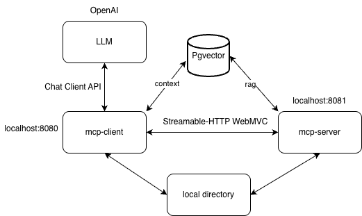
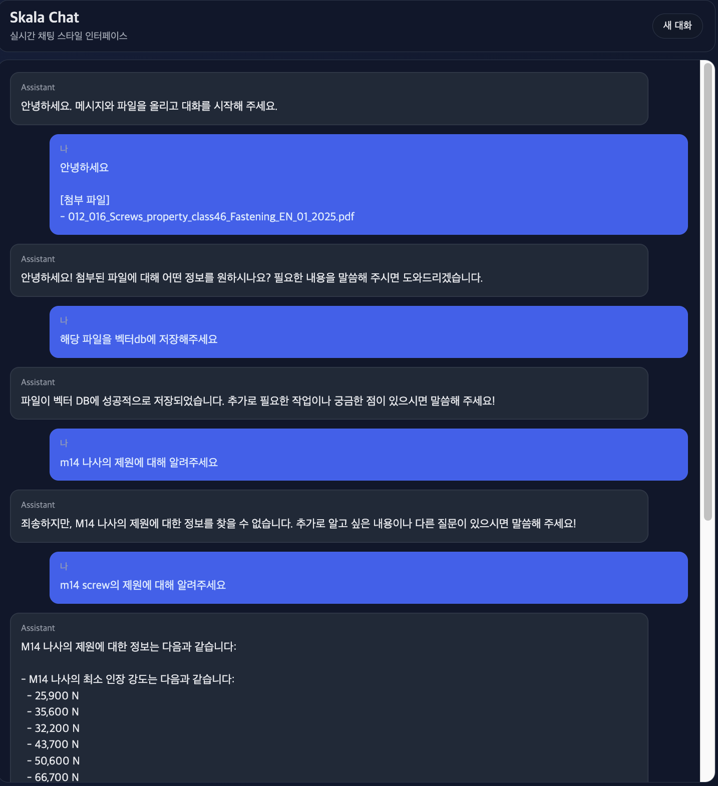
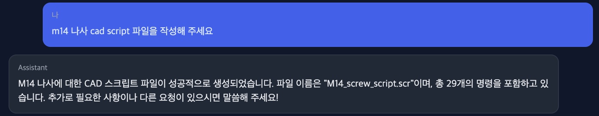

# Text-to-Cad

자연어로 CAD 모델을 생성하는 프로젝트입니다.  
RAG를 활용해 보유한 기계요소(나사, 브라켓, 볼트, 너트, 플레이트)들의 제원들을 데이터베이스에서 검색하여, LLM이 CAD 모델링을 수행할 수 있도록 지원합니다.  
실제 산업현장에서 설계 문서, 도면, 부품들의 제원, 협력사들의 카탈로그 등 다양한 형태로 존재하는 정보들을 손쉽게 데이터로 변환하고,  
AI Agent가 이를 활용하여 추천 설계, 모델링, 도면 작성 등을 수행할 수 있도록 하는 것을 목표로 합니다.

## 현재 진행 상황
- PDF Text Embedding 및 PG Vector DB 구현
- RAG 기반 제원 검색 기능 구현
- LLM에 대한 질의로 Cad Script 생성 구현
- 자연어로 File 저장 및 목록 조회 기능 구현
- 채팅을 이용한 자연어 입력 기능 구현

## 향후 계획
- PDF에서 표를 인식하여 Embedding하는 기능 구현
- Document VLLM을 활용하여 PDF에서 이미지와 텍스트를 Embedding하는 기능 구현
- CAD 모델링 API 또는 MCP와 연동하여 정밀한 CAD Script 생성 기능 구현
- AutoCAD, SolidWorks 등과 연동하여 CAD 모델링 생성 및 도면 작성 기능 구현

## 기술 스택
- LLM: OpenAI GPT-4
- Embedding: OpenAI Text-Embedding-3-small
- Vector DB: PG Vector
- PDF Text Extraction: TikaDocumentReader

## 프로젝트 구조

## 실행 스크린샷

